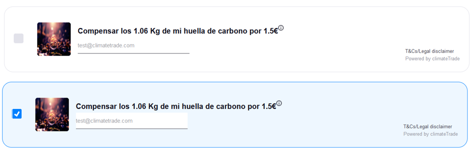

# 
 ClimateTrade's Carbon Offset - Documentación 

## 
 Construcción del Front-End Marzo 2022. 

  

 
 
 

| Tabla de Contenidos |
|------------------- |
| 1. [Tecnologías utilizadas](#1-tecnologías-utilizadas)    |
| 2. [Instalación](#2-instalación)                          |
| &nbsp;&nbsp;&nbsp;&nbsp;2.1 [Archivo zip](#2.1-zip)       |
| &nbsp;&nbsp;&nbsp;&nbsp;2.2 [Mediante FTP](#2.2-ftp)      |
| 3. [Configuración y uso del plugin](#3-configuración-y-uso-del-plugin)|
| &nbsp;&nbsp;&nbsp;&nbsp;3.1 [Forma 1](#3.1-forma-1)       |
| &nbsp;&nbsp;&nbsp;&nbsp;3.2 [Forma 2](#3.2-forma-2)       |
| &nbsp;&nbsp;&nbsp;&nbsp;3.1 [Forma 3](#3.3-forma-3)       |
| &nbsp;&nbsp;&nbsp;&nbsp;3.1 [Forma 4](#3.4-forma-4)       |

# 1. Tecnologías Utilizadas

Para la construcción del Front-End del widget, se utilizaron las siguientes tecnologías:

- **wordpress v5.9.3** (Sistema CMS sobre el cual se montará el widget)
- **PHP v8.1.2** (Lenguaje script para el desarrollo de aplicaciones del lado del servidor)
-	**MySQL v8.0.26** (Sistema gestor de base de datos)
-	**woocommerce v6.3.1** (Complemento eCommerce que se anexa a wordpress)
- **widgetclimatetrade v1.0.0** (Complemento desarrollado para integrar el cobro de la huella de carbono en la tienda de aplicaciones)

# 2. Instalación
Como requisitos previos para la instalación del plugin es necesario contar con los siguientes elementos:
<ol>
  <li>Instalar y configurar wordpress</li>
  <li>Instalar y configurar woocommerce</li>
</ol>

## 2.1 Archivo zip

Una de las formas de instalar el widget es hacerlo utilizando un archivo con formato zip que contendrá toda la información del widget de climatetrade, los pasos para su instalación son los siguientes:

<ol>
  <li>Acceder al panel de administración de wordpress</li>
  <li>Dirigirse hacia la sección de plugins</li>
  <li>Presionar el botón Añadir nuevo</li>
  <li>Presionar el botón Subir plugin y aparecerá un formulario</li>
  <li>Seleccionar la opción examinar y seleccionar el archivo zip que contiene el widgetclimatetrade.</li>
  <li>Presionar el botón Instalar ahora</li>
  <li>Regresar a la sección de plugins del menú de administración lateral, dentro del listado que aparece, ubicar el widget ClimateTrade’s Carbon Offset que ha sido instalado y presionar la opción Activar.</li>
</ol>

## 2.2 Cliente FTP
<ol>
  <li>Configurar el cliente de FTP, agregando la IP, el usuario y la contraseña del usuario.</li>
  <li>Depositar todo el contenido del archivo zip con la solución del widget climatetrade en la carpeta dentro de la instalación de wordpress.</li>
  <li>Ir hacia la sección de plugins</li>
  <li>Dentro de todos los plugins que se tienen instalados, ubicar el widget ClimateTrade’s Carbon Offset y presionar la opción Activar.</li>
</ol>

# 3. Configuración y uso del plugin

Cuando el plugin ha sido instalado y activado de forma correcta (punto 2), en el menú de administración de wordpress, aparecerá una nueva opción Climatetrade en el panel de administración lateral, al dar clic sobre esta opción se accederá a la configuración del widget.

Dependiendo de las opciones ingresadas en la configuracion del plugin, el widget cambiara su diseño.

## 3.1 Forma 1. Imagen, título, descripción y CTA.

Si el usuario ingresa estos valores, el widget sera visualizado de la siguiente forma

  

## 3.2 Forma 2. título, descripción y CTA.

Si el usuario ingresa estos valores, el widget sera visualizado de la siguiente forma

  

## 3.3 Forma 3. Imagen y CTA.

Si el usuario ingresa estos valores, el widget sera visualizado de la siguiente forma

  

## 3.4 Forma 4. CTA.

Si el usuario ingresa estos valores, el widget sera visualizado de la siguiente forma

  

